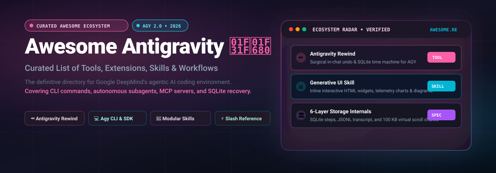

  

# Awesome Google Antigravity 

> A curated list of awesome tools, skills, extensions, workflows, and resources for **Google Antigravity (AGY)** — Google DeepMind's agentic AI coding environment.

[Google Antigravity](https://antigravity.google) is an advanced agentic coding environment featuring autonomous subagent orchestration, built-in browser automation, multi-turn reasoning, and local SQLite state persistence.

---

## Contents

- [Essential Developer Tools](#-essential-developer-tools)
- [Skills & Customizations](#-skills--customizations)
- [Slash Commands Reference](#-slash-commands-reference)
- [Workflow Automation & Hooks](#-workflow-automation--hooks)
- [Architecture & Storage Internals](#-architecture--storage-internals)
- [Community & Discussions](#-community--discussions)
- [Contributing](#-contributing)

---

## 🛠️ Essential Developer Tools

- **[Antigravity Rewind](https://github.com/ilyassbourass/antigravity-rewind)** — The surgical time machine, in-chat undo engine, and conversation manager for Google Antigravity. Safely roll back turns, purge context-polluting refusal blocks (*"I cannot assist with that"*), fix runaway thinking loops, create lossless SQLite snapshots, and restart Antigravity with 1-click. Available as a zero-install Windows binary (`.exe`).
- **[Antigravity CLI (`agy`)](https://antigravity.google)** — The official command-line interface for running Antigravity sessions in headless environments, CI pipelines, and automated script runners.
- **[Freebuff Baseline Windows](https://github.com/ilyassbourass/freebuff-baseline-windows)** — Optimized compatibility runtime for running agentic developer tools on older Windows x64 CPUs lacking AVX2 instructions.

---

## 🧩 Skills & Customizations

Antigravity uses folders containing `SKILL.md` (with YAML frontmatter) to dynamically equip agents with domain-specific knowledge and scripts.

- **`agy-customizations`** — Guide and reference for the Antigravity customization system: loading priorities, rules, plugins, hooks, and MCP servers.
- **`antigravity-guide`** — Comprehensive reference and sitemap for Google Antigravity, including the CLI, IDE, Python SDK, slash commands, and sidecars.
- **`generative-ui`** — Instructions and scripts for rendering interactive HTML widgets, charts, and diagrams inline in conversation threads.
- **`migrate-workflows`** — Automation tool to migrate legacy agent workflows to modern modular skills.

---

## ⚡ Slash Commands Reference

Quick shortcuts available directly in the Antigravity prompt bar:

| Command | Purpose | When to Use |
| :--- | :--- | :--- |
| `/goal` | Autonomous Deep Dive | Long-running tasks where the agent shouldn't stop until fully accomplished. |
| `/plan` | Structured Planning | Complex tasks requiring step-by-step architectural breakdown before coding. |
| `/boost` | Deep Thinking & Verification | High-rigor tasks requiring multi-perspective verification and deep reasoning. |
| `/grill-me` | Interactive Design Interview | Solicits user preferences and aligns on architecture before execution. |
| `/browser` | Web & DOM Automation | Tasks requiring live web scraping, web app interaction, or DOM testing. |
| `/teamwork-preview` | Multi-Agent Team | Spawns a team of autonomous subagents collaborating concurrently. |
| `/learn` | Behavior Persistence | Teaches the agent a permanent preference or workflow for future sessions. |
| `/schedule` | Recurring Cron & Reminders | Sets up one-shot timers or recurring cron triggers in the background. |

---

## 🔄 Workflow Automation & Hooks

- **Subagent Delegation (`invoke_subagent`)** — Launch background worker subagents (`research`, `self`, or custom-defined agents) with isolated or shared workspaces.
- **Reactive Wakeups** — Antigravity agents automatically wake up upon task completion or subagent messages, eliminating wasteful polling loops.
- **Background Task Management** — Monitor long-running dev servers, test runners, and compilation pipelines via `manage_task`.

---

## 🏛️ Architecture & Storage Internals

Antigravity stores local developer data inside `~/.gemini/antigravity/` (on Windows: `C:\Users\<user>\.gemini\antigravity\`):

- **`conversations/<id>.db`** — SQLite database containing all conversation steps (`idx`, timestamps, data payloads, WAL journal).
- **`brain/<id>/.system_generated/logs/`**:
  - `transcript.jsonl` — Compact line-by-line event log of the conversation.
  - `transcript_full.jsonl` — Full payload logs containing untruncated model thoughts and tool outputs.
  - `chunks/` — Virtual scroll buffer split into fixed 100 KB (`102,400 bytes`) files for smooth IDE rendering.
- **`annotations/<id>.pbtxt`** — Human-readable session titles and metadata in protobuf text format.

> 💡 **Tip:** If your conversation is locked or corrupted, use **[Antigravity Rewind](https://github.com/ilyassbourass/antigravity-rewind)** to atomically repair and rewind all 6 layers simultaneously.

---

## 🌐 Community & Discussions

- [Google Antigravity Official Portal](https://antigravity.google)
- [Google AI Developers Forum](https://discuss.ai.google.dev/)
- [r/GoogleGeminiAI on Reddit](https://www.reddit.com/r/GoogleGeminiAI/)

---

## 🤝 Contributing

Contributions are welcome! Please read the [contribution guidelines](CONTRIBUTING.md) before submitting a pull request.

---

## 📄 License

To the extent possible under law, [Ilyass Bourass](https://github.com/ilyassbourass) has waived all copyright and related or neighboring rights to this work.
